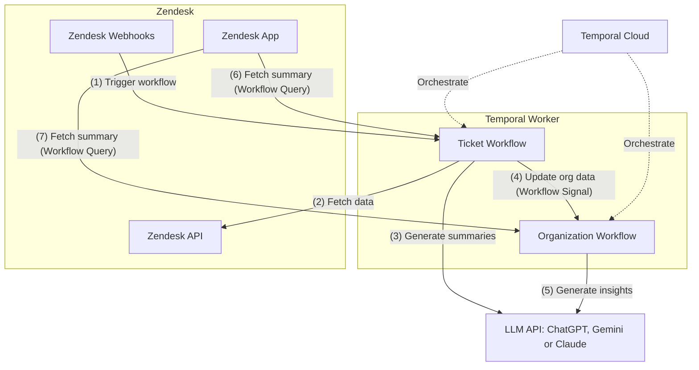

# TicketFu

[](https://github.com/taonic/ticketfu/actions)
[](https://codecov.io/gh/taonic/ticketfu)

TicketFu is an AI-powered support ticket analysis system that integrates with Zendesk to provide enhanced ticket management capabilities. Built on Temporal for reliable, durable workflow execution, it uses modern LLMs (OpenAI, Google Gemini, or Anthropic) to generate ticket summaries and organization-level insights, making it easier for support teams to manage customer issues efficiently while ensuring fault-tolerance and scalability.

## Features

- **AI-Powered Ticket Analysis**: Automatically generates concise summaries of support tickets
- **Organization-Level Insights**: Synthesizes organization-wide patterns and trends based on all ticket activity
- **Reliable Workflow Processing**: Uses Temporal for durable, reliable background processing
- **Multiple LLM Support**: Compatible with OpenAI, Google Gemini, and Anthropic models

## Deployment Options

### For Cloud Deployment

#### Prerequisites

1. **Zendesk Account**  
   TicketFu integrates with Zendesk to fetch and analyze support tickets. If you don't have a Zendesk account, you can [sign up for a free trial](https://www.zendesk.com/register/).

2. **Render Account**  
   For easy cloud deployment, create a [Render account](https://dashboard.render.com/register).

3. **Temporal Cloud Account**  
   For production deployments, we recommend using Temporal Cloud for reliable workflow orchestration. You can [sign up for Temporal Cloud here](https://temporal.io/cloud).

4. **LLM API Access**  
   You'll need an API key from one of the supported LLM providers:
   - [OpenAI API](https://platform.openai.com/signup)
   - [Google AI (Gemini) API](https://aistudio.google.com/)
   - [Anthropic API](https://console.anthropic.com/signup)

#### One-Click Deployment on Render

The easiest way to get started in production is with Render's one-click deploy:

[](https://render.com/deploy?repo=https://github.com/taonic/ticketfu)

#### Render Environment Variables

After deploying with the one-click button, you'll need to configure these environment variables in your Render dashboard:

- `LOG_LEVEL`: Set to `debug` for development or `info` for production (default: `debug`)
- `SERVER_API_TOKEN`: API token for authenticating requests from Zendesk to your TicketFu server (auto-generated by default)
- `TEMPORAL_NAMESPACE`: Namespace for Temporal workflows. If using Temporal Cloud, this will be in the format `<namespace>.<account_id>` (default: `default`)
- `TEMPORAL_ADDRESS`: Address of your Temporal server. If using Temporal Cloud, the format will be `<region>.<cloud_provider>.api.temporal.io:7233` (you can copy this from your Temporal Cloud namespace settings page). For local development, use `localhost:7233`
- `TEMPORAL_API_KEY`: API key for Temporal Cloud (if using Temporal Cloud)
- `ZENDESK_SUBDOMAIN`: Your Zendesk subdomain
- `ZENDESK_EMAIL`: Your Zendesk admin email
- `ZENDESK_TOKEN`: Your Zendesk API token ([how to generate](https://support.zendesk.com/hc/en-us/articles/4408889192858-Creating-and-using-API-tokens))
- `LLM_PROVIDER`: Your preferred provider (`openai`, `googleai`, or `anthropic`)
- `LLM_MODEL`: The model to use (e.g., `gpt-4o-mini` for OpenAI)
- `LLM_API_KEY`: Your LLM provider's API key

All these variables are defined in the `render.yaml` file and will be prompted during deployment. Once deployed, note the service URL as you'll need it when configuring your Zendesk app.

#### Installing the Zendesk App After Deployment

After deploying TicketFu on Render, follow these steps to install the Zendesk app:

1. **Copy Your API Token**
   - Go to your Render dashboard
   - Navigate to your TicketFu service
   - Click on "Environment" in the left menu
   - Find and copy the auto-generated `SERVER_API_TOKEN` value

2. **Package the App**
   ```bash
   cd zendesk_app
   npm run build
   cd dist && zip -r ticketfu.zip *
   ```

3. **Upload to Zendesk**
   - In Zendesk, go to **Admin Center** > **Apps and integrations** > **Manage**
   - Click **Upload private app**
   - Upload the `ticketfu.zip` file

4. **Configure the App**
   When prompted, enter the following settings:
   - **API Token**: Your TicketFu server API token. (Copy from SERVER_API_TOKEN when using Render)
   - **Server URL**: The URL where your TicketFu server is deployed (e.g., `https://ticketfu-abc123.onrender.com`)

5. **Install the App**
   - Click **Install**

The app will now appear in your Zendesk Support interface when viewing tickets and organizations.

#### Configuring Zendesk Webhooks and Triggers

To automate ticket analysis whenever a new ticket is created or updated, you'll need to set up Zendesk triggers with webhooks:

1. **Create a Webhook Target**:
   - In Zendesk, go to **Admin Center** > **Objects and rules** > **Webhooks**
   - Click **Create webhook**
   - Set the following:
     - **Name**: TicketFu Ticket Update
     - **Endpoint URL**: `https://<e.g. https://ticketfu-abc123.onrender.com>/api/v1/ticket`
     - **Request method**: POST
     - **Request format**: JSON
   - Add the following HTTP headers:
     - Header name: X-Ticketfu-Key
     - Value: YOUR_SERVER_API_TOKEN`
   - Click **Create webhook**

2. **Create a Trigger**:
   - Go to **Admin Center** > **Objects and rules** > **Triggers**
   - Click **Create trigger**
   - Configure basic information:
     - **Title**: TicketFu Analysis
     - **Category**: Notifications
   - Set the conditions:
     - Meet any of these conditions:
       - Ticket: Is Created
       - Ticket: Comment Text Changed
       - Ticket: Priority Changed
   - Set the actions:
     - **Notify webhook**: Select the webhook you created
     - **JSON body**:
       ```json
       {
         "ticket_url": "{{ticket.url}}"
       }
       ```
   - Click **Create trigger**

### Local Deployment

For development or testing, you can run TicketFu locally:

1. **Clone the Repository**
   ```bash
   git clone https://github.com/taonic/ticketfu.git
   cd ticketfu
   ```

2. **Set Up Temporal**
   ```bash
   # Install Temporal CLI
   curl -sSf https://temporal.download/cli.sh | sh
   
   # Start Temporal Server in dev mode
   temporal server start-dev
   ```

3. **Build TicketFu**
   ```bash
   go build -o ticketfu cmd/ticketfu/main.go
   ```

4. **Run the Server**
   ```bash
   ./ticketfu server start \
     --server-api-token YOUR_API_TOKEN \
     --temporal-address localhost:7233
   ```

5. **Run the Worker** (in a separate terminal)
   ```bash
   ./ticketfu worker start \
     --zendesk-subdomain your-zendesk \
     --zendesk-email user@example.com \
     --zendesk-token YOUR_ZENDESK_TOKEN \
     --llm-provider openai \
     --llm-model gpt-4o-mini \
     --llm-api-key YOUR_LLM_API_KEY \
     --temporal-address localhost:7233
   ```

6. **Test the API**
   ```bash
   curl -H "X-Ticketfu-Key: YOUR_API_TOKEN" http://localhost:8080/health
   ```

### Local Zendesk App Development

For testing the Zendesk app locally, you can use the Zendesk CLI:

1. **Install Zendesk CLI**
   ```bash
   npm install -g @zendesk/zcli
   ```

2. **Login to Zendesk**
   ```bash
   zcli login
   ```

3. **Navigate to the Zendesk App Directory**
   ```bash
   cd zendesk_app
   ```

4. **Start the Local App Server**
   ```bash
   zcli apps:server
   ```

5. **Test the App in Zendesk**
   - Go to your Zendesk Support instance in your browser
   - Append `?zcli_apps=true` to the URL
   - The locally running app will now appear in the sidebar

This setup allows you to develop and test changes to the Zendesk app without having to constantly repackage and upload it to your Zendesk instance.

## Architecture

TicketFu is built with a modular architecture that consists of two main components:

1. **Server Component**:
   - Handles HTTP requests via RESTful API endpoints
   - Manages authentication and authorization via API tokens
   - Communicates with Temporal for workflow orchestration
   - Provides health check and monitoring endpoints

2. **Worker Component**:
   - Processes tickets and organizations in background workflows
   - Fetches ticket data from Zendesk API
   - Generates AI summaries using configured LLM providers
   - Maintains ticket and organization state using Temporal workflows

### Architecture Diagram



### Workflow Architecture

TicketFu uses Temporal for workflow orchestration, implementing the "Entity Workflow" pattern:

- Each entity (ticket or organization) has its own long-running workflow instance
- The workflow maintains the entity's state and handles all operations for that entity
- External events trigger operations via signals
- Queries allow reading the current state without interrupting workflow execution

## Installation

```bash
go install github.com/taonic/ticketfu/cmd/ticketfu@latest
```

## Usage

### Starting the Server

```bash
ticketfu server start \
  --server-api-token YOUR_API_TOKEN \
  --temporal-address localhost:7233
```

### Starting a Worker

```bash
ticketfu worker start \
  --zendesk-subdomain your-zendesk \
  --zendesk-email user@example.com \
  --zendesk-token YOUR_ZENDESK_TOKEN \
  --llm-provider openai \
  --llm-model gpt-4o-mini \
  --llm-api-key YOUR_LLM_API_KEY \
  --temporal-address localhost:7233
```

## Configuration

### Server Configuration

| Parameter | Environment Variable | Description | Default |
|-----------|---------------------|-------------|---------|
| `--host` | `HOST` | Server host address | "0.0.0.0" |
| `--port` | `PORT` | Server port | 8080 |
| `--server-api-token` | `SERVER_API_TOKEN` | API token for request authentication | (required) |

### Worker Configuration

| Parameter | Environment Variable | Description | Default |
|-----------|---------------------|-------------|---------|
| `--queue` | `WORKER_QUEUE` | Worker queue name | "default" |

### Zendesk Configuration

| Parameter | Environment Variable | Description | Default |
|-----------|---------------------|-------------|---------|
| `--zendesk-subdomain` | `ZENDESK_SUBDOMAIN` | Zendesk subdomain | (required) |
| `--zendesk-email` | `ZENDESK_EMAIL` | Zendesk email | (required) |
| `--zendesk-token` | `ZENDESK_TOKEN` | Zendesk API token | (required) |

### LLM Configuration

| Parameter | Environment Variable | Description | Default |
|-----------|---------------------|-------------|---------|
| `--llm-provider` | `LLM_PROVIDER` | LLM provider (openai, googleai, anthropic) | "openai" |
| `--llm-model` | `LLM_MODEL` | LLM model name | "gpt-4o-mini" |
| `--llm-api-key` | `LLM_API_KEY` | LLM API key | (required) |
| `--ticket-summary-prompt` | `TICKET_SUMMARY_PROMPT` | Prompt for ticket summary generation | (default prompt) |
| `--org-summary-prompt` | `ORG_SUMMARY_PROMPT` | Prompt for organization summary generation | (default prompt) |

### Temporal Configuration

| Parameter | Environment Variable | Description | Default |
|-----------|---------------------|-------------|---------|
| `--temporal-address` | `TEMPORAL_ADDRESS` | Temporal service address | "127.0.0.1:7233" |
| `--temporal-namespace` | `TEMPORAL_NAMESPACE` | Temporal namespace | "default" |
| `--temporal-api-key` | `TEMPORAL_API_KEY` | Temporal API key | (optional) |
| `--temporal-tls-cert` | `TEMPORAL_TLS_CERT` | Path to Temporal TLS certificate | (optional) |
| `--temporal-tls-key` | `TEMPORAL_TLS_KEY` | Path to Temporal TLS key | (optional) |

## API Endpoints

TicketFu exposes the following RESTful API endpoints:

- `GET /health`: Health check endpoint
- `POST /api/v1/ticket`: Process a new ticket or update an existing one
- `GET /api/v1/ticket/{ticketId}/summary`: Get a specific ticket's AI-generated summary
- `GET /api/v1/organization/{orgId}/summary`: Get organization-level insights and analysis

All API requests require the `X-Ticketfu-Key` header with your SERVER_API_TOKEN value. When you install the Zendesk app, you'll configure it to use this same token to authenticate requests to your TicketFu server.

## Development

### Prerequisites

- Go 1.23 or higher
- Temporal server (for workflow orchestration)
- API key for one of the supported LLM providers

### Running Tests

```bash
go test ./...
```

### Building From Source

```bash
go build -o ticketfu cmd/ticketfu/main.go
```

## Temporal Setup

TicketFu requires a Temporal service for reliable workflow execution. There are several options for setting up Temporal:

### Local Development

For local development, you can run Temporal server using Docker:

```bash
docker run --detach \
  --network host \
  --name temporal \
  temporalio/auto-setup:1.22.4
```

### Temporal Cloud

For production, consider using [Temporal Cloud](https://temporal.io/cloud):

1. Sign up for Temporal Cloud
2. Create a namespace
3. Generate an API key from the Temporal Cloud dashboard
4. Configure TicketFu with:
   ```
   --temporal-address <region>.<cloud_provider>.api.temporal.io:7233 \
   --temporal-namespace <namespace>.<account_id> \
   --temporal-api-key <api-key>
   ```

You can find the exact address format in your Temporal Cloud namespace settings page. For more details, see the [Temporal Cloud documentation](https://docs.temporal.io/cloud/api-keys#namespace-authentication).

### Self-Hosted Temporal Cluster

For self-hosted options, refer to the [Temporal documentation](https://docs.temporal.io/clusters/server-options).

## Contributing

Contributions are welcome! Please feel free to submit a Pull Request.

## License

[MIT](LICENSE)
